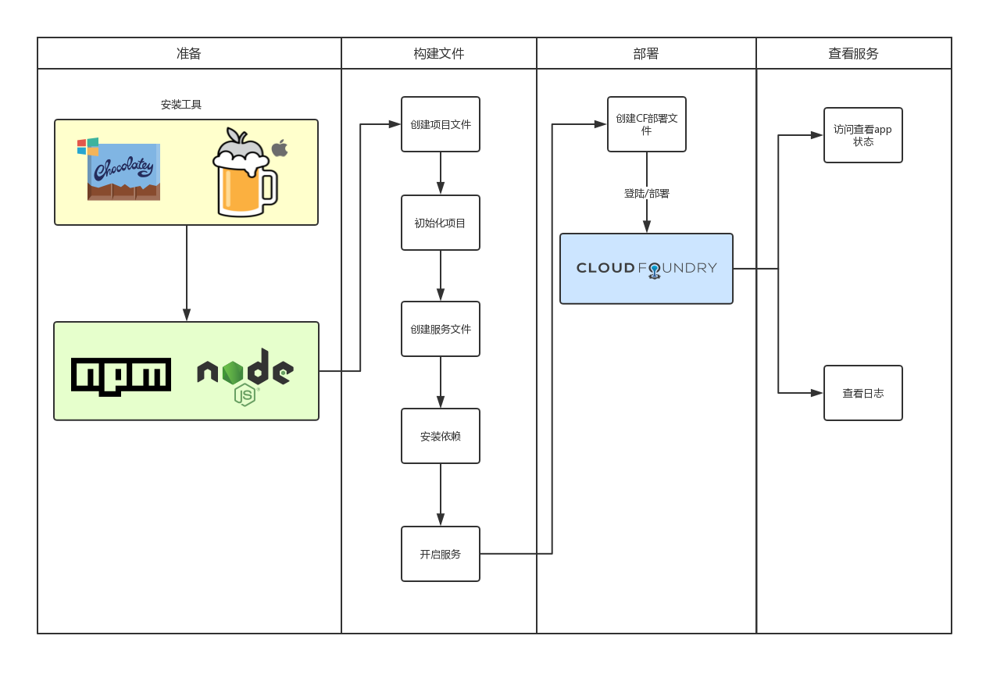
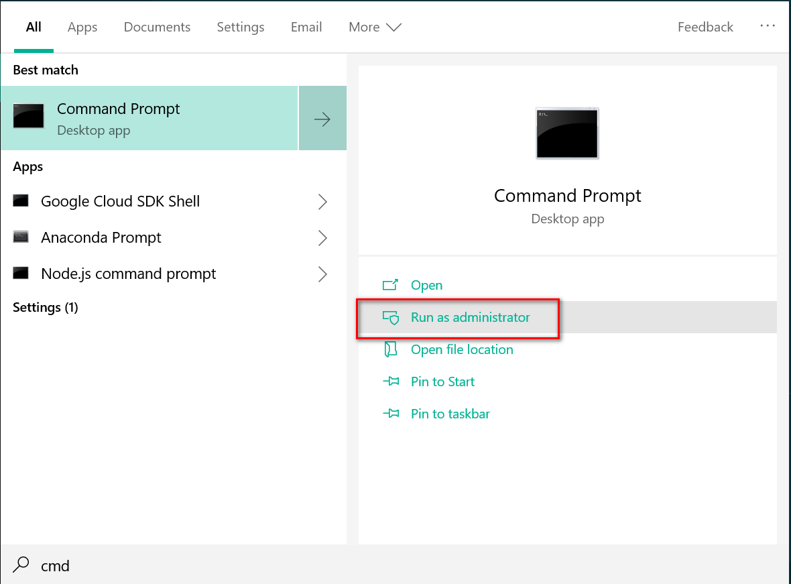
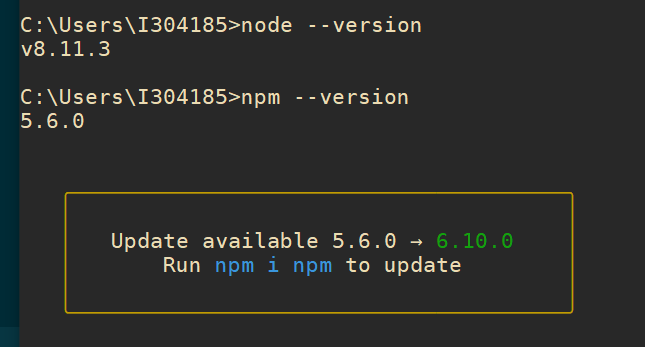
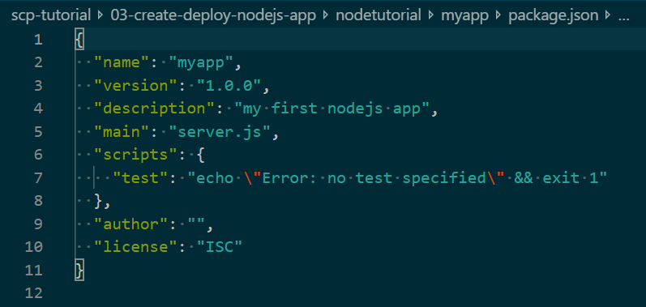
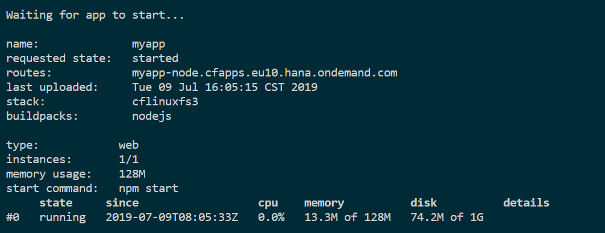

<!-- TOC -->

- [创建部署第一个node.js app](#创建部署第一个nodejs-app)
  - [创建基础的 Node.js App](#创建基础的-nodejs-app)
    - [1. 准备基础环境](#1-准备基础环境)
    - [2.验证安装情况](#2验证安装情况)
    - [3. 创建你的application](#3-创建你的application)
    - [3. 创建`server.js`文件，作为服务器放在myapp文件夹下面，代码如下](#3-创建serverjs文件作为服务器放在myapp文件夹下面代码如下)
    - [4. 安装依赖](#4-安装依赖)
    - [5. 开启你的应用](#5-开启你的应用)
  - [使用你的Cloud Foundry CLI部署你的Node.js App](#使用你的cloud-foundry-cli部署你的nodejs-app)
    - [1. 创建mainfest文件](#1-创建mainfest文件)
    - [2 部署app到Cloud Foundry Space中](#2-部署app到cloud-foundry-space中)
  - [将日志添加到Node.js应用程序](#将日志添加到nodejs应用程序)
    - [1. 添加一些日志信息](#1-添加一些日志信息)
    - [2. 删除已存在的应用(不推荐使用)](#2-删除已存在的应用不推荐使用)
    - [3. Push更新后的应用（推荐使用）](#3-push更新后的应用推荐使用)
    - [4. 转储应用程序日志](#4-转储应用程序日志)
    - [5. 应用程序日志数据流](#5-应用程序日志数据流)

<!-- /TOC -->

# 创建部署第一个node.js app


## 创建基础的 Node.js App
创建一个基础的Node.js app，在本机运行

### 1. 准备基础环境
>Node.js是基于Chrome的V8 JavaScript引擎构建的服务器端运行时环境。 它提供事件驱动的非阻塞（异步）I / O和跨平台运行时环境。 它使您能够使用JavaScript构建可伸缩的服务器端应用程序，并且是开源的。 Node.js可用于构建各种类型的应用程序，如命令行应用程序，Web应用程序，REST API服务器和许多其他应用程序。 它主要用于创建Web服务器等网络程序。 有关更多信息，请访问官方网站https://nodejs.org。

在开始构建Node.js应用程序之前，需要安装`npm`和`Node.js`. `npm`包含在`Node.js`安装中。

可以自己下载库并组织目录并以此方式开始。 但是，随着您的项目（以及依赖项列表）的增长，这将很快变得混乱。 它还使协作和共享代码变得更加困难。

您可以在操作系统上使用软件包管理器（推荐）或使用安装程序：[Download installer](https://nodejs.org/en/download/)  

软件包管理器安装  
**Windows安装**  
安装[Chocolatey](https://chocolatey.org)(windows package manager)  
以管理员身份打开CMD


输入以下`bash`
```bash
@powershell -NoProfile -ExecutionPolicy Bypass -Command "iex ((New-Object System.Net.WebClient).DownloadString('https://chocolatey.org/install.ps1'))" && SET "PATH=%PATH%;%ALLUSERSPROFILE%\chocolatey\bin"
```
安装`node.js`
```bash
choco install nodejs
```

**Mac安装**  
安装[Homebrew](https://brew.sh)（Mac包管理器），如果尚未安装, 在Mac terminal里面输入bash,安装brew
```bash
/usr/bin/ruby -e "$(curl -fsSL https://raw.githubusercontent.com/Homebrew/install/master/install)"
```
安装`node.js`
```bash
brew install node
```

### 2.验证安装情况
要验证安装是否成功，请检查`npm`和`node.js`版本。 打开命令行工具并查询版本。  


### 3. 创建你的application
1. 为Node.js应用程序创建一个名为nodetutorial的专用目录，并在其中创建另一个名为myapp的目录。
2. 要启动应用程序设置，请转到myapp目录并在命令行中执行npm init, 自动创建一个`package.js`文件
```bash
user@host:~/nodetutorial/myapp
=> npm init
```



>所有npm包都包含一个文件，通常在项目根目录中，名为package.json。 该文件包含与项目相关的各种元数据。 该文件用于向npm提供信息，使其能够识别项目以及处理项目的依赖项。 package.json文件位于Node.js项目的根目录下。

### 3. 创建`server.js`文件，作为服务器放在myapp文件夹下面，代码如下
```javascript 
const express = require('express');
const app = express();

app.get('/', function (req, res) {
  res.send('Hello World!');
});

const port = process.env.PORT || 3000;;
app.listen(port, function () {
  console.log(`myapp listening on port ${port})`)
});
```

### 4. 安装依赖
您的应用程序已准备就绪。 在您真正可以访问Web服务器之前，需要下载所需的模块。 如果您查看在上一步中创建的server.js文件，则在那里使用express模块在计算机上尚未提供。 因此，运行以下命令让npm处理依赖项：
```bash
user@host:~/nodetutorial/myapp
=> npm install express
```
您现在应该在myapp目录中有一个新（自动）创建的目录node_modules，其中包含所有依赖项模块。 将使用已安装的模块更新package.json。

文件目录结构如下
```
nodetutorial
└── myapp
    ├── node_modules
    ├── package-lock.json
    ├── package.json
    └── server.js
```

### 5. 开启你的应用
现在应用程序可以在本地启动，使用以下命令启动它：
```bash
user@host:~/nodetutorial/myapp
=> node server.js
```
您应该在命令行上看到myapp在端口3000上侦听。 在浏览器中打开http://localhost:3000访问您的Web服务器时，会获得Hello World响应。

## 使用你的Cloud Foundry CLI部署你的Node.js App
使用Cloud Foundry命令行界面准备要部署到SAP Cloud Platform的Node.js应用程序。
### 1. 创建mainfest文件
在nodetutorial目录中创建manifest.yaml文件。 此文件是部署描述文件，包含将应用程序部署到SAP Cloud Platform Cloud Foundry实例所需的所有信息。
```yml
---
applications:
- name: myapp
  random-route: true
  path: myapp
  memory: 128M
```
>属性random-route将生成一个路由，该路由不会与同一Cloud Foundry实例中的任何其他应用程序冲突。
现在应该具有以下目录结构：
```
nodetutorial
├── manifest.yaml
└── myapp
    ├── node_modules
    ├── package-lock.json
    ├── package.json
    └── server.js
```
mainfest属性的说明：

| Property | Name	Value
|---|---|
| name | 用于在Cloud Foundry上部署应用程序的应用程序名称 
| host | 自定义host地址，子域中可以被访问
| path | 从中部署内容/工件的本地文件系统的路径
| memory | 应用程序分配的内存配额
>有关清单文件的更多字段，请参阅[官方文档](https://docs.cloudfoundry.org/devguide/deploy-apps/manifest.html)。

### 2 部署app到Cloud Foundry Space中
确保您已登录到SAP Cloud Platform Cloud Foundry端点`cf login`并通过`cf space <SPACE>`导航到您的空间。 在nodetutorial目录中执行以下命令：
```bash
user@host:~/nodetutorial
=> cf push
```
确保您之前通过cf login登录，否则push命令将失败.Cloud Foundry命令行界面隐式使用manifest.yaml文件来部署应用程序。部署之后后，在命令行中显示应用程序的状态：


或者可以访问应用程序, 它显示URL等信息。 通过以下方式访问应用程序概述：
```
user@host:~/nodetutorial
=> cf apps
```

访问此列表中显示的URL。 在相应的URL访问Web服务器时，您应该获得“Hello World”响应。

## 将日志添加到Node.js应用程序
修改Node.js应用程序以添加一些基本日志记录，并学习通过Cloud Foundry命令行界面访问日志

### 1. 添加一些日志信息
应用权限以两种不同的方式产生输出。 第一，它会记录您的应用程序正确启动时使用的端口。 第二，它在访问HTTP端点时发送响应（'Hello World'）。

再添加两条日志信息。 相应地更改server.js文件：

```javascript
const express = require('express');
const app = express();

app.get('/', function (req, res) {
  res.send('Hello World!');
  console.log('Hello World sent to Browser at: ' + new Date() ); //new line
});

const port = process.env.PORT || 3000;
app.listen(port, function () {
  console.log('myapp is using Node.js version: ' + process.version); //new line
  console.log('myapp listening on port ' + port);
});
```
添加了两个额外的日志语句。 第一个记录访问端点的时间。 第二个告知Web服务器启动时使用的Node.js版本。

>SAP Cloud Platform Cloud Foundry使用的Node.js版本可能与本地使用的版本不同。 package.json文件未指定SAP Cloud Platform Cloud Foundry应使用的engine.version（即节点版本）。 因此，SAP Cloud Platform Cloud Foundry使用默认版本。 步骤4将显示已注销的以及Cloud Foundry实际使用的版本。 有关engine.version用法的更多信息，请参阅[Cloud Foundry文档](https://docs.cloudfoundry.org/buildpacks/node/index.html)。

### 2. 删除已存在的应用(不推荐使用)
在将应用程序重新部署到SAP Cloud Platform Cloud Foundry之前，不必删除该应用程序。 但在某个时间点，知道这个命令可能会有用。 请注意，删除应用时也会删除日志。
```
cf delete myapp
```
>此步骤不是强制性的


删除掉app之后，同时需要删除掉route
```
cf delete
```
### 3. Push更新后的应用（推荐使用）
要推送更新的Node.js应用程序，请在nodetutorial目录中执行以下命令。
```
cf push
```
通过检查应用程序, 验证应用程序是否已成功启动：
```
cf apps
```

### 4. 转储应用程序日志
日志主要有两种不同的显示方式。

第一种选择是通过以下方式将应用程序的最近日志消息转储到终端：
```
cf logs myapp --recent
```


在输出日志文件中，您已经可以看到在部署过程中发生的情况，如果出现问题并且您的应用程序无法启动，将会有所帮助。

>屏幕截图还应显示应用程序的不同日志输出，就像它在本地运行时一样。 节点版本是隐式设置的：例如 'myapp正在使用Node.js版本：v10.15.3'。 现在可以访问应用程序的端口也与本地计算机上的端口不同。 应用程序采用环境变量“port”，这是端口8080。


### 5. 应用程序日志数据流
第二种选择是流式传输日志。 与转储不同，日志流可以对**特殊用例（如实时调试应用程序**有所帮助。 应用程序在处理Web请求时会写入日志消息。 运行以下命令以实时访问它们：
macOS / Linux:
```
cf logs myapp | grep -v RTR
```

windows
```
cf logs myapp | findstr /V RTR
```
每当有人通过相应的URL访问应用程序时，您的终端将打印一个新行。 `grep -v RTR`（在macOS / Linux上）或`findstr / V RTR`（在Windows上）从所谓的路由器中排除特定日志。 这也可以省略，仅用于演示目的。


