<!-- TOC -->

- [创建并不熟第一个Java App](#创建并不熟第一个java-app)
  - [使用MTA模板准备一个Java app](#使用mta模板准备一个java-app)
    - [1. 从模板中创建一个新项目](#1-从模板中创建一个新项目)
    - [2. 找到你的项目](#2-找到你的项目)
  - [添加一个Java app到你的Multi-Target Application](#添加一个java-app到你的multi-target-application)
    - [1. 启动“新建Java模块”向导](#1-启动新建java模块向导)
    - [2. 通过模板添加Java Module](#2-通过模板添加java-module)
  - [运行、测试、部署你的Java app](#运行测试部署你的java-app)
    - [1. 运行你的Java app](#1-运行你的java-app)
    - [3. 在Cloud Foundry中确认app运行状态](#3-在cloud-foundry中确认app运行状态)
  - [Debug你的Java app](#debug你的java-app)
    - [1. 添加一个断电在程序中](#1-添加一个断电在程序中)
    - [2. 设置debugger选项](#2-设置debugger选项)
    - [3. 打开Debugger](#3-打开debugger)

<!-- /TOC -->
# 创建并不熟第一个Java App

## 使用MTA模板准备一个Java app 
使用多目标应用程序（[Mult-Target Application - MTA](https://www.sap.com/docs/download/2016/06/e2f618e4-757c-0010-82c7-eda71af511fa.pdf)）模板准备构建简单的Java应用程序。

>请注意，SAP Web IDE上的大多数信息都将引用将应用程序部署到名为Neo的传统SAP Cloud Platform数据中心基础架构，但是先决条件部分使用的教程中包含有关如何使Java开发人员能够利用Cloud Foundry的信息空间。

### 1. 从模板中创建一个新项目
要在Web IDE中创建Java应用程序并进行部署，首先需要创建一个多目标应用（MTA)程序项目。

打开SAP Web IDE，然后从主页单击“从模板中新建项目”。
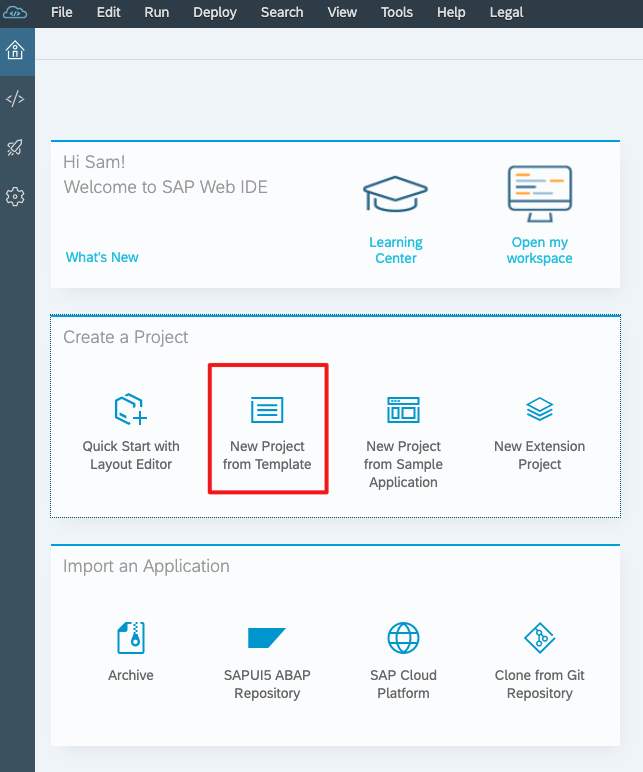

创建 MTA 项目

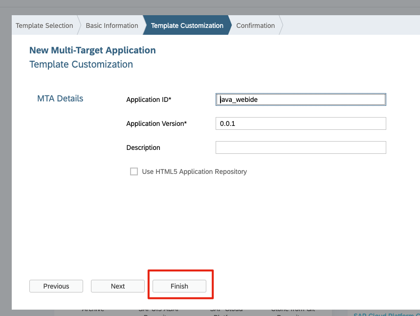

### 2. 找到你的项目
现在，您将在Workspace文件资源管理器中看到新的Java应用程序。 在本教程中，您将在文件列表中看到项目文件夹java_webide。

## 添加一个Java app到你的Multi-Target Application
通过将Java模块添加到多目标应用程序（MTA），开始了解使用SAP Web IDE修改现有代码库。

### 1. 启动“新建Java模块”向导
在SAP Web IDE中，导航到“开发”透视图并展开“工作区”文件夹。
右击项目 -> 新建 -> Java Module

### 2. 通过模板添加Java Module
现在您已打开Java模块模板选择向导，可以向下滚动以从切片列表中选择简单Web应用程序。

您应该会看到此模板将在突出显示的图块下方添加的内容的说明。

点击下一步。
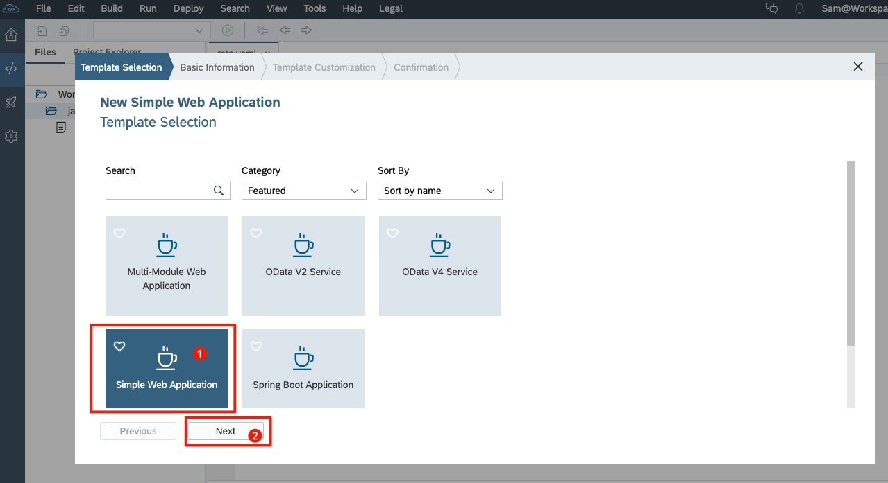

为项目命名
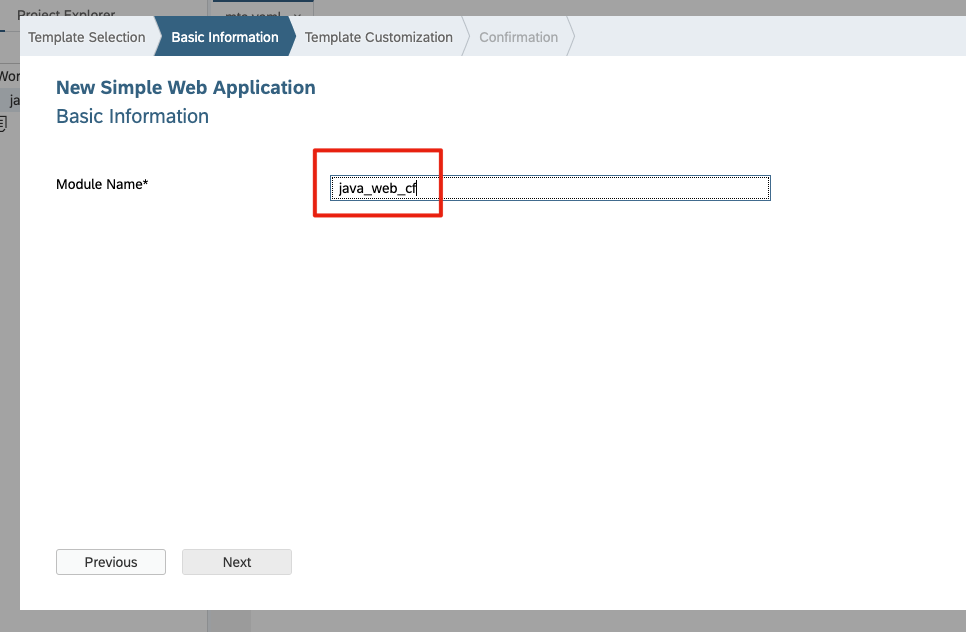
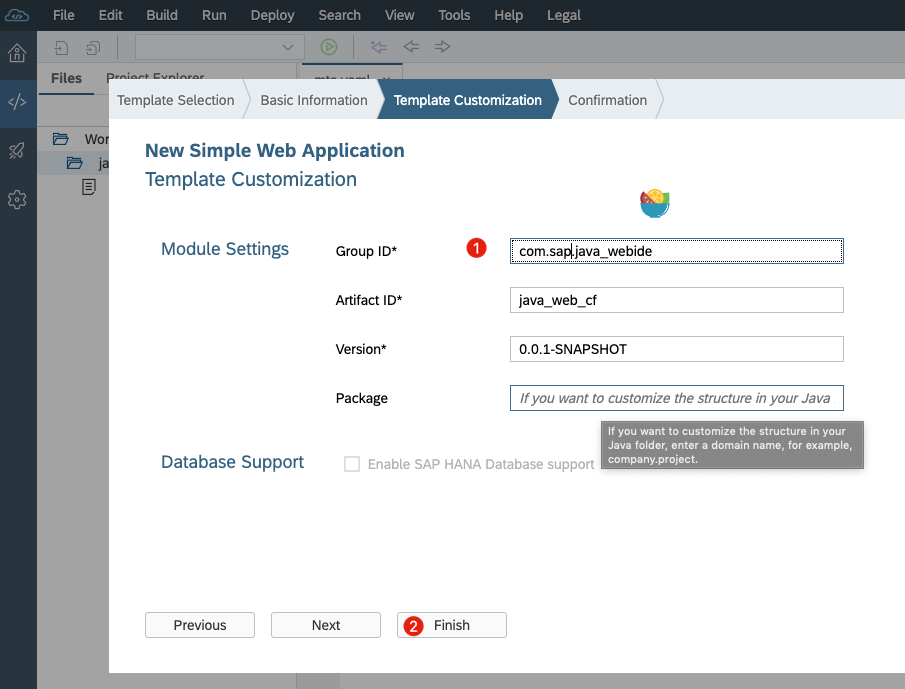
您应该有一个新的文件树结构。
单击带有+符号的任何文件夹以展开它们。

## 运行、测试、部署你的Java app 
使用SAP Web IDE运行，测试和部署Java应用程序到SAP Cloud Platform。

在下面的步骤中，您将首次运行Java应用程序。 如果您尚未为工作区启用Cloud Foundry工具，我们将确认这些工具也处于活动状态。

### 1. 运行你的Java app
在SAP Web IDE中，导航到Development透视图并展开Workspace文件夹以访问cf_web_app Java项目。
右键单击HelloServlet.java文件，然后选择“运行”>“Java应用程序”。
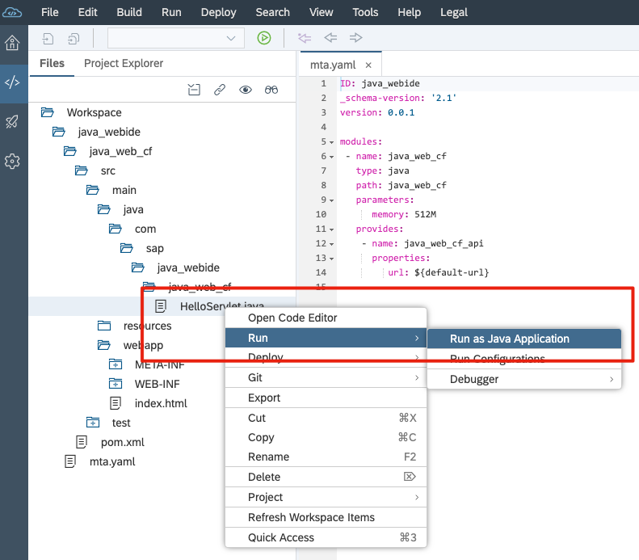

在运行程序的时候，如果出现Cloud Foundry设置问题，请首先设置好Cloud Foundry的配置。请参考[04-enable-full-stack-webide](https://github.com/milkdeliver/scp-tutorial/blob/master/04-enable-full-stack-webide/enable-full-stack-webide.md)
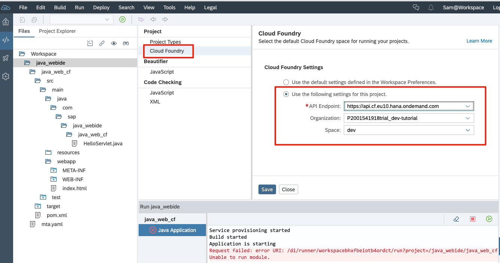

配置之后，在重新运行java程序，成功后，可以在webIDE控制台上看到，实际的运行地址。
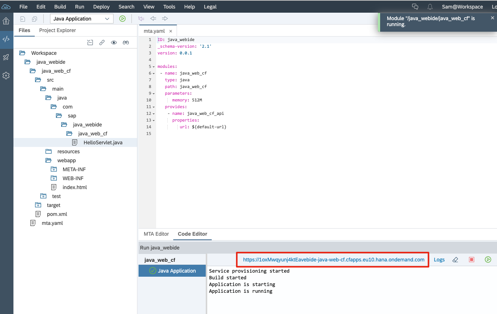

在浏览器中输入java web app的地址，访问服务。

### 3. 在Cloud Foundry中确认app运行状态
此时，我们可以去Cloud Foundry的Space环境中查询app运行状态。
打开SAP Cloud Platform Cockpit，然后单击Cloud Foundry试用磁贴。  点击进去，进入Global Accounts.
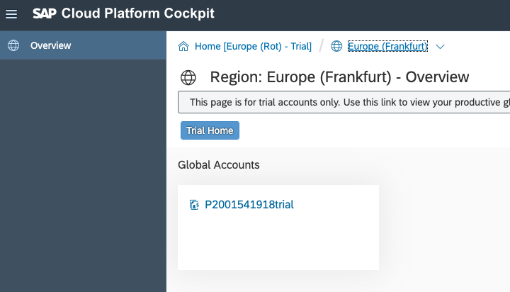

点击计入名为dev子账户，
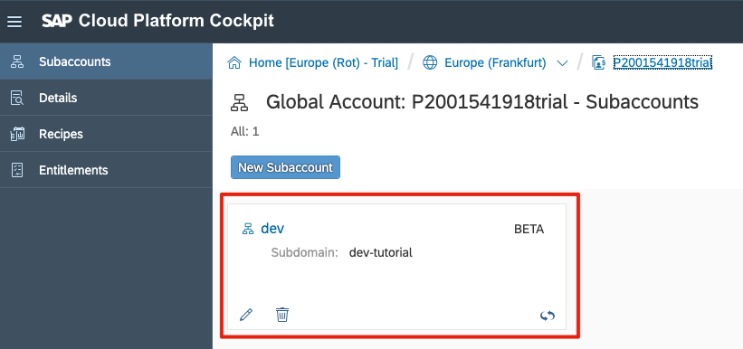

点击左边Spaces，进入到dev Space中
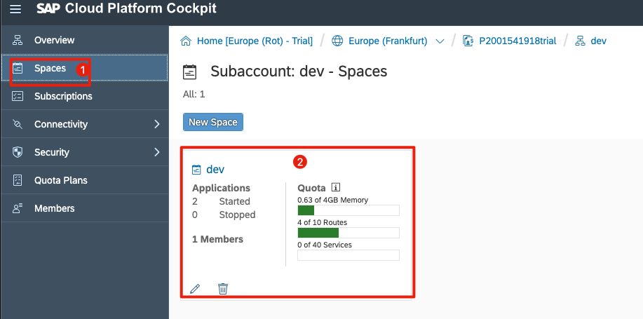

在Space的Applications下面，可以看到我们部署Java app正常运行。

## Debug你的Java app
运行程序之后，我们肯定有需求对项目进行调试，接下来我们会学习如何使用webIDE进行调试。

### 1. 添加一个断电在程序中
要使用内置调试器，需要添加断点。 在本教程中，您将添加一个断点。 您需要打开应用程序以添加断点。

1. 打开 HelloServlet.java文件
2. 导航到36行，并在此设置断点。  

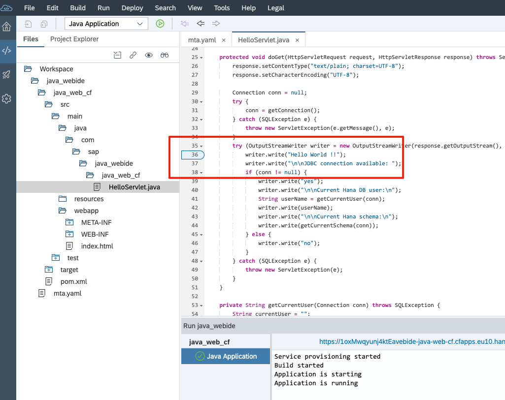

### 2. 设置debugger选项
现在您有了断点，您可以再次运行您的应用程序。 但为了确保调试器打开，让我们设置选项。

1. 在菜单栏下面选择 Run -> Run Configurations  
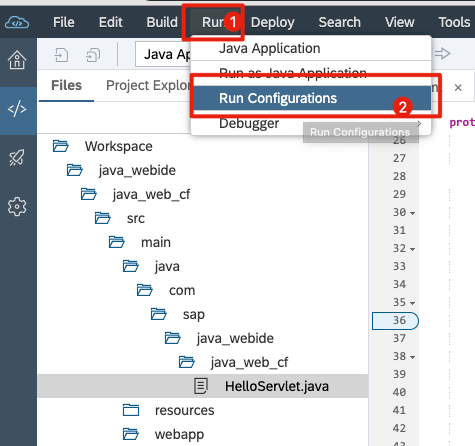

2. 选择 Java Application同时勾选上 Run in debug mode.
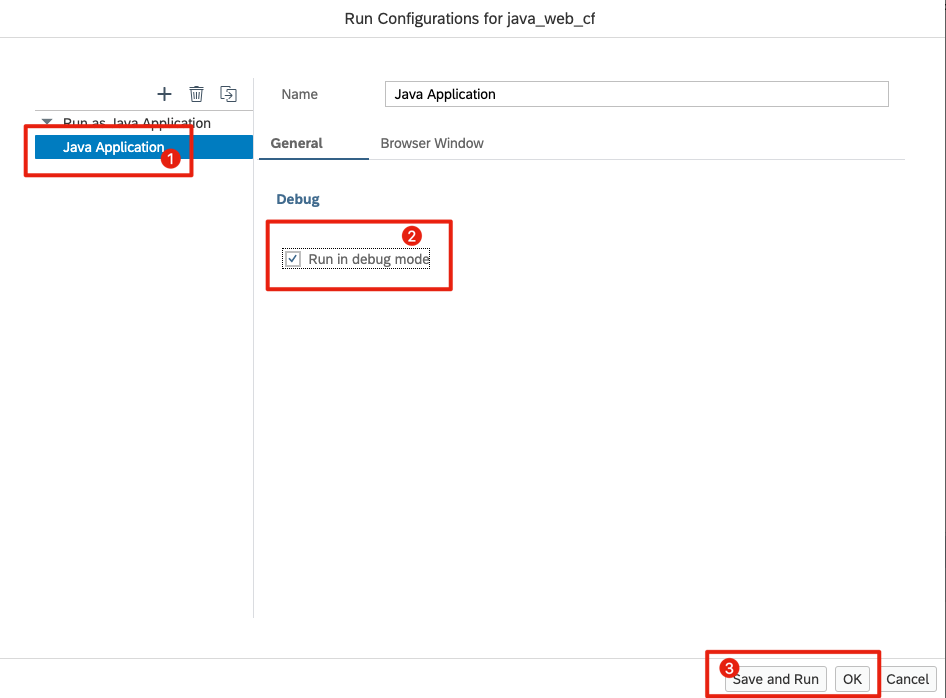

回到SAP Web IDE，一旦设置了运行配置，就有几种不同的方式来运行应用程序。 选择文件后，可以单击顶部菜单上的“运行”，然后单击“Java应用程序”。

### 3. 打开Debugger
除了在调试模式下选择Run之外，还有一些快速选项可以访问调试器窗口。您可以选择最右侧栏中的错误图标，或者从菜单栏中选择View> Debugger。  
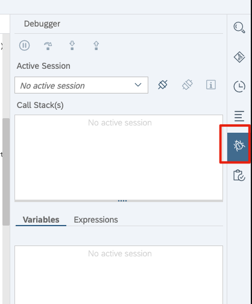

添加断点后，您将在顶部工具栏中看到一个小的绿色“运行”图标。

如果要在添加断点的情况下运行它，只需按绿色的“运行”图标即可。激活其中一个选项后，您将看到SAP Web IDE右侧打开调试器窗口。
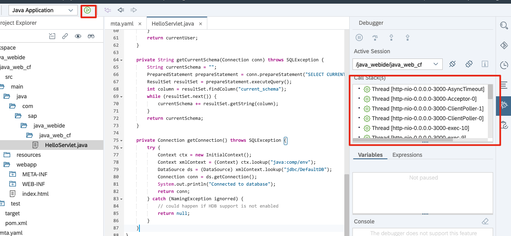

现在，让我们在SAP Web IDE面板的单个视图中总结此步骤中描述的选项。 所有文件编辑器，调试器和断点都在运行和显示。

但我们在浏览器中访问service，可以看到在debug状态下，我们进入预先设定36行的断点。现在就可以对程序进行调试了。
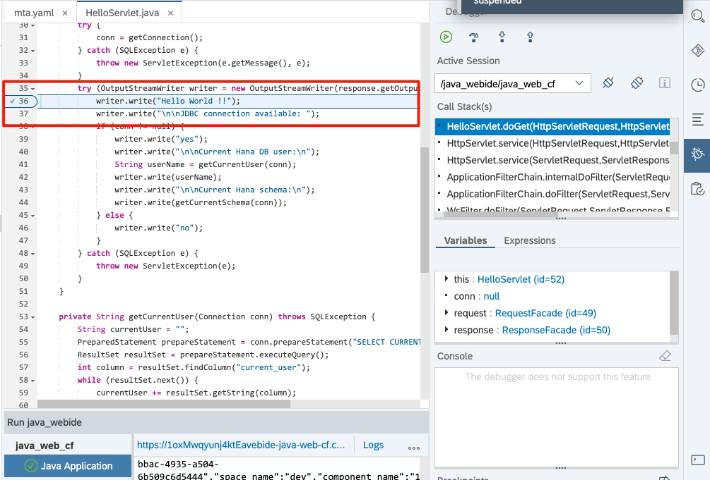

